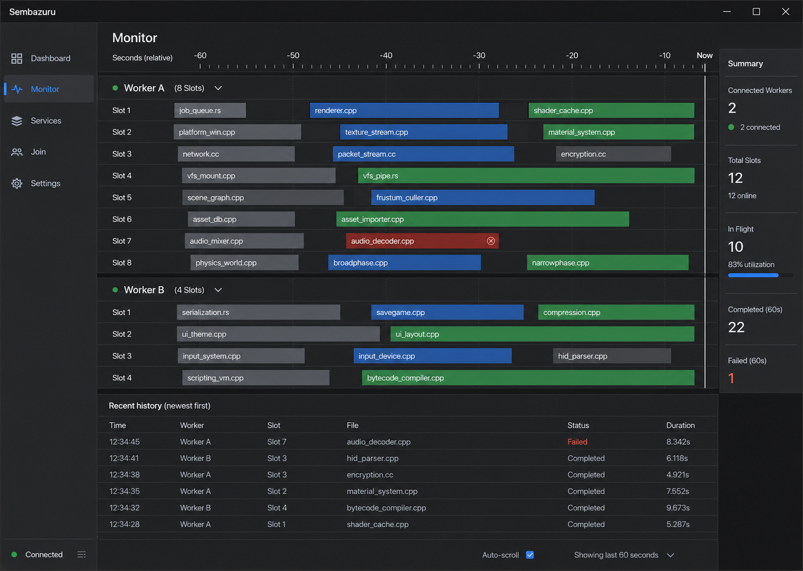

# 速度改善とライブビルドモニタ設計

- 日付: 2026-07-11
- 状態: チャット上の設計承認済み、本文レビュー待ち
- 対象: Sembazuru の production VFS 経路と常駐 GUI
- 優先順位: 速度改善を先に完了し、その後にライブビルドモニタを実装する

## 背景

現行コードのレビューで、production build の待ち時間に直結する次の2点が見つかった。

1. action cache の prefetch hint が相対 `logical` path と `Absent` input を含み、
   enforcing file session で役に立たない一方、最大4096 taskを生成し得る。
2. 256 KiBのrange requestごとにCAS blob全体を読み直し、大きい入力で読み込み量が
   二次的に増える。

同時に、GUIで「どのworkerのどの実行slotが、どのソースを処理しているか」を
Incredibuild風のタイムラインとして見たい、という要求がある。

この設計は、速度上の既知の傷を先に直し、計測可能な状態を保ったままライブ表示を追加する。

## ロードマップ上の位置づけ

既存ロードマップではライブ監視UIはM15に置かれ、Horizon 2はM10 GO後の着手とされている。
今回の明示承認により、M15のうち「worker別active TUのタイムライン」だけを先行実装する。

この変更だけでM15完了とはしない。M15の残りであるremote/local分割、cache hit率、
現時点の速度向上の統合表示は、既存Dashboardまたは後続仕様で扱う。

## 目標

### 速度

- 有効なprefetchがcompilerのforeground readを妨げずに先行する。
- CAS range readのdisk read量とallocationを要求範囲に比例させる。
- 正しさ、session capability、digest ACL、local fallbackを維持する。
- 変更前後を同じcorpusで比較できる測定点を残す。

### モニタ

- workerごとの実行slotを60秒の横方向タイムラインで表示する。
- 実行中・完了・失敗を、色と文字の両方で区別する。
- 1.5秒未満の短いactionも、daemon側履歴から次のpollで表示する。
- retry、worker reassignment、local fallbackを誤って同じ実行として潰さない。
- full path、argv、environment、tokenをGUIへ公開しない。

## 非目標

- processを物理CPU coreへaffinity固定すること。
- 物理core番号を表示すること。画面上のlaneはexecution slotである。
- compiler固有のイベントを解析し、1つのMSBuild batch内部の現在TUを特定すること。
- server-streamingによるsub-second push。MVPは有界snapshot履歴を既存pollで読む。
- 永続的なbuild履歴、検索、export、分析DB。
- Status transport全体のnamed-pipe化。ただし新しいactivity projectionの脅威評価と
  basename開示の暫定リスク明記は今回の必須範囲とする。
- M15全体を完了扱いにすること。

## 選択した視覚方向



画像は情報階層と密度の目標であり、pixel-perfectな仕様ではない。既存eguiアプリの
navigation、色、spacing、最小window sizeを優先し、依存crateは追加しない。

## 実装順序

変更は独立に検証・commitできる4フェーズへ分ける。

1. Prefetch pathと並列度の修正
2. CAS range readの追加
3. Agent側ActionTrackerとStatus protocol
4. GUI Monitor tabとタイムライン描画

各フェーズは前フェーズのtestとbenchmarkを再実行してから次へ進む。

## Phase 1: Prefetch修正

### 現状の問題

`AgentCache::predicted_paths` はmanifestの全inputを先頭から4096件取り、`logical` pathを返す。
そのため次の問題が同時に起きる。

- `Absent` inputまでhintへ入る。
- relative pathがenforcing sessionのabsolute path検査で拒否される。
- filter前にquotaを適用するため、先頭の無効entryが有効なContentを押し出す。
- workerがhintごとにtaskを作り、FileClientのrequest permitをforeground readと競合する。

### 決定

- hint対象は `InputKind::Content` だけとする。
- wireへ送る値はmanifestの `absolute` pathとする。
- `normalized_vfs_root` を `predicted_paths` へ渡し、agent-authoritative root内のpathだけを残す。
  root外のSDK headerはworker-local入力であり、VFS prefetch hintには含めない。
- Windowsの大小文字とseparator差を正規化したkeyで重複排除する。
- `Content → root内判定 → normalize/dedupe → quota` の順に処理し、scope外entryが
  有効entryを4096件quotaから押し出さないようにする。
- worker側prefetch並列度は32に制限する。FileClient全体の128 in-flightのうち、
  少なくとも96をforeground requestへ残す。
- prefetch failureはadvisoryとして記録し、action自体は失敗させない。
- compilerからのforeground hydrateはprefetchの完了を待たない。

### TDD受入条件

- relative `logical` ではなくabsolute `Content` pathを返すtestが先に失敗する。
- 先頭4096件が `Absent`、末尾が有効 `Content` のmanifestでも有効pathが残る。
- 先頭4096件がroot外 `Content`、末尾がroot内 `Content` でもroot内pathが残る。
- Windowsのcaseとseparatorだけが違うpathを1件へdedupeする。
- prefetch helperのpeak concurrencyが32を超えない。
- production配線を通すintegration testで、enforcing session内のhintがwarmになる。
- hintが拒否・missingでもforeground openが通常どおり成功または既存fallbackへ進む。

### 測定

- 8/16/32/64並列を比較し、p50/p95 hydrate latency、foreground read latency、
  peak task数、転送bytesを記録する。
- 既定値32は測定でforeground p95を悪化させる場合にだけ下げる。

## Phase 2: CAS range read

### 現状の問題

workerは256 KiB単位でReadを要求するが、agentは毎回 `BlobStore::get` でblob全体を
`Vec`へ読み、その一部だけを返す。16 MiBなら64回の全読み込みになり、logical disk readは
約1 GiBまで増える。

### 決定

- `BlobStore::get_range(digest, offset, len)` を同期APIとして追加する。
- 実装は短命な `File` をopenし、seekして最大 `len` byteだけ読む。
- Rust 1.96のWindows既定openは `FILE_SHARE_DELETE` を含むため、そのままでは既存CAS commentの
  eviction前提を満たさない。共通read-open helperでshare modeを
  `FILE_SHARE_READ | FILE_SHARE_WRITE` に明示し、handleが開いているrequest中のdeleteを拒否する。
- request間のevictionは次requestをmissingにしてdigest完成を失敗させ、既存fallbackへ送る。
  将来このCASへ定期evictionを接続する場合は、range化前提としてlive digest leaseを追加する。
- `open_read` のinline chunkと `read_range` の両方をrange APIへ置換する。
- blocking file I/OはTokio runtime上で直接行わず `spawn_blocking` へ送る。
- 現行hot pathの `BlobStore::get` はdigest再検証をしていないため、range化でも検証強度を
  下げない。session pin、digest visibility、worker側の完成blob検証はそのまま維持する。
- missing、I/O error、途中truncateは不完全な正解として返さず、空応答またはerrorとして
  worker側digest failureから既存fallbackへ送る。

### API意味論

- `len == 0`: 空byte列。
- `offset >= EOF`: 空byte列。
- `offset < EOF` かつ `offset + len > EOF`: EOFまで返す。
- blobなし: `None`。
- seek/read failure: `Err`。
- `offset + len` はchecked/saturating計算でoverflowさせない。

### TDD受入条件

- zero length、先頭、中間、EOF跨ぎ、offsetがEOF以上、missing blobのtestが先に失敗する。
- inline 64 KiBと複数256 KiB rangeと末尾端数を連結し、元blobと一致する。
- session外digestはrange化後も読めない。
- Windowsでread handle中の `remove_file` が失敗し、drop後に成功する競合testを追加する。
- chunk間deleteでは完成digest検証が失敗し、torn bytesを成功扱いしない。
- 1/16/64 MiB blobでwall time、peak RSS、要求byte、実読み込みbyteを旧実装と比較する。

### 計測方法

- range helperを `Read + Seek` へ分離し、test用counting readerで累積read request byteと
  最大buffer sizeが要求範囲を超えないことを証明する。
- Windows benchmarkは `GetProcessIoCounters` の `ReadTransferCount` とpeak working setを
  処理前後で採る。既存 `ServerStats.read_bytes` はwire byteなのでdisk read証拠には使わない。
- wall timeは同一blob size・同一chunk列を5回実行した中央値で比較する。

## Phase 3: ActionTrackerとStatus protocol

### 情報源

- intakeがaction開始とcommandを知る。
- schedulerがworker選択、retry、fallbackを知る。
- `drive_execute` がworkerの `Queued`、`Preparing`、`Running`、`Completed`、`Failed`
  eventを受け取る。

heartbeatは約5秒遅延しaction identityを持たないため、モニタの情報源にはしない。

### ActionTracker

daemonにclone可能な `ActionTracker` を追加する。内部状態は有界で、次を保持する。

- `action_id`
- `attempt_no`
- `worker_id`
- `execution_kind`: remote / local / fallback
- `display_name`
- `state`
- `lane_index`: 1-based。queued中は0。
- monotonicなstarted/finished時刻
- duration

retryの一意keyは `(action_id, attempt_no)` とする。同じactionがworkerを移った場合も
別attemptとして履歴に残す。

trackerの唯一の更新入口は次の3操作に限定する。

- `begin_attempt(action_id, attempt_no, target, kind, display_name)`
- `transition((action_id, attempt_no), next_state)`
- `finish_attempt((action_id, attempt_no), terminal_state)`

許可する状態遷移は次の単調な順序とする。worker eventが中間状態を省略する場合は前方skipを
許すが、後退は無視する。

```text
Created -> Queued -> Preparing -> Running -> Completed | Failed | Interrupted
```

`Failed` と `Interrupted` は `Running` 前からも到達可能とする。terminalへの同一更新はidempotent、
異なるterminalへの上書きは拒否して記録する。

schedulerはremote dispatch直前にattemptを生成する。retry時は旧attemptをterminal化してから
`attempt_no + 1` を生成する。remote失敗後のlocal fallbackも同じactionの新attemptとし、
`target = local`、`kind = fallback` を使う。worker disconnectは該当workerのactive attemptを
`Interrupted`へ閉じてlaneを解放する。

`Running`を受けた時点で、worker内の空いている最小laneを割り当てる。terminal eventでlaneを
解放する。capacityより多く見える不整合時は既存laneを上書きせず、overflow laneを一時的に
追加して観測事実を優先する。

### 保持上限

- terminal後60秒で削除する。
- 全体最大4096 attempt。
- `display_name` はUTF-8で最大128文字。
- 上限到達時はterminal済みの古いentryから削除する。
- active entryは履歴entryより優先して保持する。

### 表示名

- argv内の `.c`、`.cc`、`.cpp`、`.cxx`、`.m`、`.mm`、`.rs` 等からbasenameを抽出する。
- 複数sourceの場合は `first.cpp +N`。
- sourceを特定できない場合はexecutable basename。
- path全体、response file内容、argv、envは保存・送信しない。

### Protocol

`GetStatusResponse` に加算的な `repeated ActionActivity activities` を追加する。
各activityはtrackerの表示用projectionであり、秘密を含まない。

ただし現行Status readはloopback TCPでcaller SIDを認証しない。basename、worker、時刻、失敗履歴は
同一端末の別local userから読めるため、これはゼロリスクではない。MVPでは次を暫定条件とする。

- basename以外のcommand情報をprojectionへ入れない。
- 60秒を超えて保持・永続化しない。
- proto/Status integration testでfull path、argv、env、response-file contentが出ないことを検査する。
- Phase 3のsecurity reviewで新しい開示面を明示的に再評価する。
- named-pipe caller認証が入るまでは「local usersへbasename metadataが見える」既知リスクを
  release noteへ記載する。これは本文レビューでleadが受容する暫定判断である。

時刻はwall clockではなくdaemonの `Instant` から計算した `started_age_ms`、
`finished_age_ms`、`duration_us` を返す。agentとGUIの時計同期を前提にしない。

MVPは既存Status pollingを使う。GUI pollerは1 requestずつ直列化し、遅い古いresponseが
新しいsnapshotを上書きしないようにする。streaming RPCは実測で1.5秒遅延が不十分だった場合の
後続候補とする。

## Phase 4: GUI Monitor tab

### 画面構成

- 既存の `Dashboard / Services / Join / Settings` に `Monitor` を追加する。
- workerごとにheaderと `Slot 1..N` laneを縦に並べる。
- 横軸は直近60秒。右端に `Now` lineを置く。
- activeは青、成功済みは緑からmuted gray、failedは赤。
- 色だけに依存せず、状態文字とhover detailを付ける。
- basenameをbar内に表示し、狭いbarはellipsisにする。
- 下部に最新順の簡潔な履歴表を置く。
- local/fallbackは物理slotを捏造せず、別の `Local / Fallback` bandへ表示する。

### 描画と状態

- 新しい描画dependencyは追加せず、eguiの `ScrollArea`、`Grid`、`Painter`、`RichText`
  だけを使う。
- serverが60秒履歴を持つため、GUI再起動直後でも直近actionを復元できる。
- worker disconnect時もterminal済み履歴は保持期限まで残し、active entryは
  `interrupted`として閉じる。
- daemon down時は既存connection stateを再利用し、架空のlaneを残さない。

### GUI test

- protoからview-modelへのmappingをpure unit testで検証する。
- worker grouping、lane order、bar位置、clamp、ellipsisをegui非依存helperで検証する。
- headless Status integrationでactive、recent、expired、retry、fallbackを検証する。
- 選択画像と実画面を同じviewportで比較するmanual visual smokeを行う。

## Error handling

- monitor更新失敗はbuild executionへ影響させない。tracker observerの失敗でactionを止めない。
- poisoned/failed tracker updateはstatus上の欠測として扱い、schedulerとworker制御を優先する。
- unknown stateは捨てず `unknown` としてmuted表示する。
- out-of-order terminal eventは既にterminalならidempotentに無視する。
- 許可されないstate後退とterminal上書きをtracker内部で拒否し、counterへ記録する。
- retry先workerのeventを旧attemptへ混ぜない。
- GUI snapshot欠落時は最後のsnapshotを無期限に信用せず、接続状態をerrorへ移す。

## Performance budget

- ActionTracker更新はaction state transitionごとにO(1)を目標とする。
- Status snapshotは最大4096件をcopyするが、CAS size scanを増やさない。
- GUI描画はvisible worker/laneを優先し、履歴全件へwidgetを無制限生成しない。
- monitor有効時とGUI未起動時でbuild throughputを比較し、5回の中央値で2%以上悪化した場合は
  次フェーズへ進まず原因を計測する。
- prefetchとrange readはそれぞれ単独benchmarkを残し、複合結果だけで判断しない。

## 検証ゲート

各実装フェーズで次を必須とする。

```text
cargo fmt --all --check
cargo clippy --workspace --all-targets -- -D warnings
cargo test --workspace
```

build outputまたはVFSを触るPhase 1・2は、同一入力のbyte-identical outputを確認する
determinism harnessも必須とする。

非自明な変更ごとに、author以外のCodex reviewとClaudeの独立reviewを通す。Claudeが利用不能なら
独立Codex二次reviewで代替し、未達ゲートを報告する。

## Done when

### 速度フェーズ

- production配線のprefetchが有効absolute Contentだけをwarmする。
- prefetch peak concurrencyが設定上限を超えず、foreground requestを飢餓させない。
- range readのdisk read量がblob全体×chunk数から要求byte比例へ下がる。
- counting readerとWindows process I/O counterの双方でrange read量の低下を示す。
- workspace test、lint、determinism、独立reviewが通る。
- 変更前後のbenchmark結果を記録する。

### モニタフェーズ

- 選択画像の情報階層でworker×slotの60秒timelineが表示される。
- 短命action、retry、failure、fallback、disconnectが履歴上で識別できる。
- GUIへbasename以外のcommand情報が渡らない。
- unauthenticated local Statusに対するbasename metadataの暫定開示をsecurity reviewとrelease noteで
  明示し、leadが受容する。
- GUI未起動時のbuild性能に有意な回帰がない。
- workspace test、lint、独立review、manual visual smokeが通る。

## 実装時に固定する境界

- Phase 1・2はprotocolやGUIを変更しない。
- Phase 3はtracker/protocol/modelまでとし、描画を混ぜない。
- Phase 4は承認済みprotocolを消費し、worker execution semanticsを変更しない。
- 速度改善の効果が反証された場合、モニタ実装で結果を覆い隠さず、測定結果を先に報告する。
